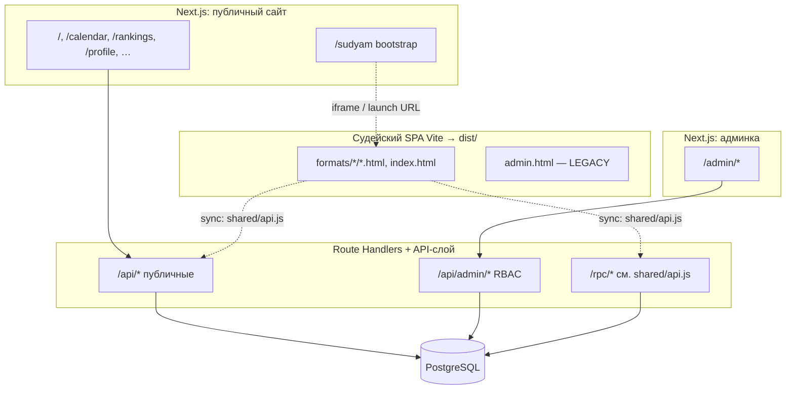

# Структура сайта и репозитория (lpvolley.ru)

Краткий ориентир для разработчиков и ИИ-агентов: контуры кода, маршруты, API и **как данные уходят из offline-first SPA в БД**. Домен в примерах не захардкожен в исходниках Next; прод разворачивается по [**docs/DEPLOY.md**](DEPLOY.md): **Next.js** из `web/` (SSR/API) и статика судейского SPA из **`dist/`** после `npm run build` в корне.

---

## Техстек

| Компонент     | Стек |
| ------------- | ---- |
| Публичный сайт и админка | **Next.js** (App Router), данные через **Route Handlers** `web/app/api/**/route.ts` |
| Судейский интерфейс      | **Vite** (MPA в корне → артефакт **`dist/`**), offline-first, PWA |
| Хранилище                | **PostgreSQL** (`web/lib/db.ts`, миграции в `migrations/`) |
| Сессии                   | **Cookie**: админы (signed JWT-подобный payload + HMAC), игроки (`player_session`), PIN судей |
| Прокси                   | **`web/middleware.ts`** учитывает **`x-forwarded-host`** / **`x-forwarded-proto`** для редиректов |

---

## Монорепозиторий: почему Next.js в `web/`

В **корне** — исходники **Vite-SPA** (`index.html`, `formats/`, `assets/js/`, **`admin.html`**). Приложение **Next.js** вынесено в **`web/`** (отдельный `package.json`). Сборка статики → **`dist/`**; депой двух контуров — в [**docs/DEPLOY.md**](DEPLOY.md).

---

## Архитектурные контуры

| Контур                   | Где в репозитории                                              | Назначение |
| ------------------------ | -------------------------------------------------------------- | ---------- |
| Публичный сайт + API     | `web/app/`, `web/app/api/` (кроме `api/admin/`)                | Лендинг, календарь, рейтинги, архив, профили, вход игрока, регистрация, партнёры; bootstrap судей (`/sudyam`) |
| Операторская админка     | `web/app/admin/`, `web/app/api/admin/`                         | CRUD турниров/игроков, ростер, заявки, merge, overrides, аудит, отчёты, архив |
| Судейский SPA            | Корень: `index.html`, `formats/`, `assets/js/`, `shared/`     | Live-матчи (KOTC, Thai, IPT и др.), локальное состояние + синхронизация с сервером |

Публичный сайт в браузере **не** подключается к PostgreSQL напрямую: и страницы Next, и SPA ходят в **HTTP API** (Next Route Handlers и при необходимости слой **PostgREST**-стиля — пути вида `/rpc/...` в [`shared/api.js`](../shared/api.js)).

---

## Поток данных: SPA → PostgreSQL

Это **не** отдельный «секретный» sync-сервис. Цепочка такая:

1. **Offline-first**  
   Судейские страницы держат состояние матча в **`localStorage`** (или эквивалент). Без сети интерфейс продолжает работать.

2. **Тот же origin / `apiBase`**  
   Клиентский модуль **[`shared/api.js`](../shared/api.js)** берёт базовый URL из **`window.APP_CONFIG.apiBase`**, иначе **`origin`** из **`APP_CONFIG.supabaseUrl`** (чтобы пути вида `/api/tournaments/...` шли на тот же сайт, а PostgREST для kotc-sync по-прежнему собирается отдельно с суффиксом `/rest/v1` в [`kotc-sync.js`](../assets/js/ui/kotc-sync.js)). Запросы — **`fetch(apiBase + path)`** (`apiGet` / `apiPost`). Опционально заголовок **`X-Org-Secret`**, если на сервере задан **`TOURNAMENT_SYNC_SECRET`** ([`web/app/api/tournaments/[id]/route.ts`](../web/app/api/tournaments/[id]/route.ts)).

3. **Что именно уходит на сервер (ориентиры по коду)**  
   | Действие | Функция в `shared/api.js` | Путь (относительно `apiBase`) |
   | -------- | ------------------------- | ------------------------------ |
   | Загрузить состояние турнира | `loadTournamentFromServer` | **`GET /api/tournaments/:id`** → Next, в БД в колонке **`game_state`**, см. миграцию [`020_tournaments_game_state_sync.sql`](../migrations/020_tournaments_game_state_sync.sql) |
   | Сохранить черновик/состояние турнира | `saveTournamentToServer`, `syncTournamentAsync` | **`POST /api/tournaments/:id`** (тот же handler) |
   | Финализация турнира и запись результатов в БД | `finalizeTournament` | `POST /rpc/finalize_tournament` |
   | Синхронизация справочника игроков с рейтингом | `syncPlayersWithServer` | `GET /rpc/get_rating_leaderboard`, `POST /api/players/bulk` (в репозитории может отсутствовать Next-handler — проверять `web/app/api/`) |
   | История рейтинга игрока | (см. файл) | `POST /rpc/get_rating_history` |

   Часть путей обслуживает **Next** (`web/app/api/`), часть — **PostgREST/RPC** на том же деплое; детали прокси см. **`web/lib/admin-postgrest.ts`** и **DEPLOY**.

4. **KOTC live / мультисудейство**  
   Отдельное дерево **Next** Route Handlers: **`/api/kotc/sessions/...`** (снимки кортов, команды, финализация сессии и т.д.). Судейский UI дергает их там, где внедрён live-режим (см. архитектурные доки по фазам 6–8).

5. **Итог**  
   Результаты из SPA в PostgreSQL попадают через **HTTP**: либо обработчики Next, либо **RPC/REST** к БД, в зависимости от пути. Отдельного фонового агента «только для SPA» в репозитории нет — связка **SPA ↔ API ↔ БД** задаётся деплоем и `APP_CONFIG`.

---

## Схема потоков (упрощённо)

Диаграмма **неполная**: перечислены не все страницы и не все API. Полный список роутов — в [таблице ниже](#таблица-маршрутов-nextjs-app-router); список handlers — `web/app/api/**/route.ts`.

---

## Пользователи, роли и где они хранятся

| Актор              | Хранение учётки | Сессия / проверка |
| ------------------ | --------------- | ----------------- |
| **Оператор админки** | **Не NextAuth.** Учётные записи задаются **переменными окружения**: массив **`ADMIN_CREDENTIALS_JSON`** (`id` + `pin` + `role`) или legacy-пины **`ADMIN_PIN`**, **`ADMIN_OPERATOR_PIN`**, **`ADMIN_VIEWER_PIN`** (см. [`web/lib/admin-auth.ts`](../web/lib/admin-auth.ts)). Таблицы `users` для логина админки в смысле «ORM User model» нет — есть **роль в cookie** после успешного `POST /api/admin/auth`. |
| **Игрок (сайт)**     | Учётные данные в **БД** (регистрация/логин через `web/app/api/auth/*`); сессия **`player_session`**. |
| **Судья**            | **PIN** (`SUDYAM_PIN`); cookie после **`/api/sudyam-auth`**; middleware на `/sudyam`, `/sudyam2`. |

RBAC для админ-API: **`requireApiRole`** в [`web/lib/admin-auth.ts`](../web/lib/admin-auth.ts) — роли **`viewer`**, **`operator`**, **`admin`** (сравнение уровней в коде).

---

## Ключевые модули `web/lib/` (админка и судьи)

| Файл | Роль |
| ---- | ---- |
| [`web/lib/admin-queries.ts`](../web/lib/admin-queries.ts) | Запросы к БД для админки |
| [`web/lib/admin-validators.ts`](../web/lib/admin-validators.ts) | Валидация payload админ-API |
| [`web/lib/admin-audit.ts`](../web/lib/admin-audit.ts) | Журнал действий |
| [`web/lib/admin-legacy-sync.ts`](../web/lib/admin-legacy-sync.ts) | LEGACY: согласование полей форматов со SPA |
| [`web/lib/sudyam-launch.ts`](../web/lib/sudyam-launch.ts) | **`buildSudyamLaunchUrl`**, разбор формата турнира |

---

## Управление турнирами (связка админки и SPA)

| Слой | Файлы | Заметка |
| ---- | ----- | ------- |
| UI админки | [`web/app/admin/tournaments/page.tsx`](../web/app/admin/tournaments/page.tsx) | Настройки формата, ссылки на судейский SPA через **`buildSudyamLaunchUrl`** |
| API | `web/app/api/admin/tournaments/*` | GET часто **`viewer+`**, мутации **`operator+`** / **`admin`** |
| Ввод данных | [`web/lib/admin-validators.ts`](../web/lib/admin-validators.ts) | Нормализация и ограничения |
| Аудит | [`web/lib/admin-audit.ts`](../web/lib/admin-audit.ts) | Запись с **`actor_id`** |
| Данные | [`web/lib/admin-queries.ts`](../web/lib/admin-queries.ts) | SQL/запросы к PostgreSQL |
| Миграции | `migrations/*.sql` | В корне репозитория |

---

## Публичное и смежное API (группы)

| Группа | Примеры путей |
| ------ | ------------- |
| Данные сайта (в основном GET) | `/api/tournaments` (список), **`/api/tournaments/[id]`** (состояние для SPA), `/api/leaderboard`, `/api/archive`, `/api/players/[id]` |
| Игрок | `/api/auth/login`, `/api/auth/register`, `/api/auth/logout`, `/api/auth/me`, … |
| Регистрация на турнир | `POST /api/tournament-register` |
| Партнёры | `/api/partner/requests`, … |
| Судья (PIN) | `/api/sudyam-auth`, `/api/sudyam/bootstrap` |
| KOTC live | `/api/kotc/sessions/...` |
| Админка | `/api/admin/*` + cookie + **`requireApiRole`** |

Полный перечень: **`web/app/api/**/route.ts`**.

---

## Технический долг и LEGACY (для агентов и новых фич)

| Маркер    | Что имеется в виду |
| --------- | ------------------ |
| **LEGACY** | **[`admin.html`](../admin.html)** (+ `admin-init.js`) — старая агрегированная страница в корне; новый операторский UX — **`/admin/*`** в Next. Не брать за образец для новых публичных фич. |
| **LEGACY** | **[`web/lib/admin-legacy-sync.ts`](../web/lib/admin-legacy-sync.ts)** — мост к старым строкам форматов/константам для совместимости с SPA. |
| **TODO / продукт** | **`/sudyam2`** — альтернативный судейский вход (KOTC-обёртка в Next, тот же PIN-gate). Уточнять у продукта: основной URL для коммуникации, не дублировать сценарии без нужды. |

---

## Auth: middleware vs страницы

| Механизм | Зона |
| -------- | ---- |
| [`web/middleware.ts`](../web/middleware.ts) | **`/admin/*`** (кроме `/admin/login`), **`/sudyam`**, **`/sudyam2`** |
| Cookie игрока | **`/profile`**, **`/partner`**, API партнёров — проверка в страницах / handlers ([`web/lib/player-auth.ts`](../web/lib/player-auth.ts)) |

---

## Таблица маршрутов (Next.js App Router)

Колонка **«Защита»** — что нужно для полного сценария.

| Путь | Защита | Файл | Назначение |
| ---- | ------ | ---- | ---------- |
| `/` | Публично | `web/app/page.tsx` | Главная |
| `/calendar` | Публично | `web/app/calendar/page.tsx` | Календарь |
| `/calendar/[id]` | Публично | `web/app/calendar/[id]/page.tsx` | Карточка турнира |
| `/calendar/[id]/register` | Публично | `web/app/calendar/[id]/register/page.tsx` | Запись на турнир → `POST /api/tournament-register` |
| `/rankings` | Публично | `web/app/rankings/page.tsx` | Рейтинги |
| `/archive` | Публично | `web/app/archive/page.tsx` | Архив |
| `/players/[id]` | Публично | `web/app/players/[id]/page.tsx` | Карточка игрока |
| `/pravila` | Публично | `web/app/pravila/page.tsx` | Правила |
| `/login` | Публично | `web/app/login/page.tsx` | Вход **игрока** (не путать с `/admin/login`) |
| `/profile` | Публично; расширенный кабинет — сессия игрока | `web/app/profile/page.tsx` | Профиль |
| `/partner` | Публично; отклики — сессия (API) | `web/app/partner/page.tsx` | Поиск пары |
| `/sudyam` | PIN (middleware) | `web/app/sudyam/page.tsx` | Судейский bootstrap Next |
| `/sudyam/login` | Публично | `web/app/sudyam/login/page.tsx` | Ввод PIN судьи |
| `/sudyam2` | PIN (middleware); **TODO: статус продукта** | `web/app/sudyam2/page.tsx` | Альтернативный KOTC-вход |
| `/admin/*` | Админ cookie | `web/app/admin/**` | Операторская панель |
| `/admin/login` | Публично | `web/app/admin/login/page.tsx` | Вход оператора → `POST /api/admin/auth` |
| `/admin/kotc-live` | Админ cookie | `web/app/admin/kotc-live/page.tsx` | KOTC Live Hub — **нет в [`AdminShell`](../web/components/admin/AdminShell.tsx) `links`**, только прямая ссылка |

**Навигация админки (`AdminShell`):** `/admin`, `/admin/tournaments`, `/admin/players`, `/admin/roster`, `/admin/requests`, `/admin/merge`, `/admin/overrides`, `/admin/audit`, `/admin/reports`, `/admin/archive`.

---

## Итог и рекомендации

Архитектура (**Next публичный + Next админ + Vite SPA + PostgreSQL + cookie-auth + proxy headers**) соответствует репозиторию. Для ИИ-агентов критично помнить: **SPA пишет в БД только через HTTP** ([`shared/api.js`](../shared/api.js) + деплой `apiBase`), а **новый публичный функционал** — в **`web/app/`**, не в корневом SPA.

---

*См. также:* [README.md](../README.md), [docs/AGENTS.md](AGENTS.md), [docs/DEPLOY.md](DEPLOY.md), [docs/DEVELOPMENT.md](DEVELOPMENT.md).
